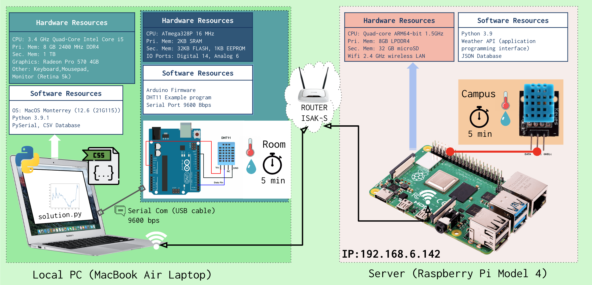

### Member: Meisa Chi, Daiichiro Nakanishi

# Unit 2: A Distributed Weather Station for ISAK

## Criteria A: Planning

## Problem definition
**Client:** Masamu Oshita (16)

**Context:** The client is a student of UWC ISAK Japan and he is currently suffering from difference in the temperature and humidity insides his room compared to the outer space in the ISAK campus. His room is too hot and dry compared to outside which is too cold and humid. And he want to have a device that would let him measure the temperture and humidity in the room, to compare to the areas outside his room, and see how he can sort out a way to adjust his room's condition to fit with the campus condition.

**Problem:** He has limited budget to buy the device that can measure the temperture and humidity.


## Proposed Solution
Considering the client requirements an adequate solution includes a low cost sensing device for humidity and temperature and a custom data script that process and anaysis the samples acquired. For a low cost sensing device an adequate alternative is the DHT11 sensor[^1] which is offered online for less than 5 USD and provides adequare precision and range for the client requirements (Temperature Range: 0°C to 50°C, Humidity Range: 20% to 90%). Similar devices such as the DHT22, AHT20 or the AM2301B [^2] have higher specifications, however the DHT11 uses a simple serial communication (SPI) rather than more eleborated protocols such as the I2C used by the alternatives. For the range, precision and accuracy required in this applicaiton the DHT11 provides the best compromise. Connecting the DHT11 sensor to a computer requires a device that provides a Serial Port communication. A cheap and often used alternative for prototyping is the Arduino UNO microcontroller [^3]. "Arduino is an open-source electronics platform based on easy-to-use hardware and software"[^4]. In additon to the low cost of the Arduino (< 6USD), this devide is programable and expandable[^1]. Other alternatives include diffeerent versions of the original Arduino but their size and price make them a less adequate solution.


## Design Statement
We will design a system on python where we can record the past 48 hours data on temperature and humidity, and then show the data as a line graph, and also show it as a linear graph. Can also compare indoors and outdoors, see the highest, the lowest and the average for both datas. Also allows the user to predict the data in the next 12 hours. We will take the data by using Arduino and it's sensor.


[^1]: Industries, Adafruit. “DHT11 Basic Temperature-Humidity Sensor + Extras.” Adafruit Industries Blog RSS, https://www.adafruit.com/product/386. 
[^2]: Nelson, Carter. “Modern Replacements for DHT11 and dht22 Sensors.” Adafruit Learning System, https://learn.adafruit.com/modern-replacements-for-dht11-dht22-sensors/what-are-better-alternatives.   
[^3]:“How to Connect dht11 Sensor with Arduino Uno.” Arduino Project Hub, https://create.arduino.cc/projecthub/pibots555/how-to-connect-dht11-sensor-with-arduino-uno-f4d239.  
[^4]:Team, The Arduino. “What Is Arduino?: Arduino Documentation.” Arduino Documentation | Arduino Documentation, https://docs.arduino.cc/learn/starting-guide/whats-arduino.  

## Success Criteria

1. The solution provides a visual representation of the Humidity and Temperature values inside a dormitory (Local) and outside the house (Remote) for a period of minimum 48 hours. 
2. The solution provides a mathematical modelling for the Humidity and Temperature levels for each Local and Remote locations. ```(SL: linear model)```
3. The solution provides a comparative analysis for the Humidity and Temperature levels for each Local and Remote locations including mean, standad deviation, minimum, maximum, and median.
4. ```(SL)```The Local samples are stored in a csv file.
5. Create a prediction the subsequent 12 hours for both temperature and humidity.
6. A poster summarizing the visual representations, model and analysis is created and communicated.

# Criteria B: Design

## System Diagram **SL**


**Fig.1** shows the system diagram for the proposed solution (**SL**). The indoor variables will be measured using an Arduino microprocessor and the sensor DHT11 conencted to the local computer (Laptop) located inside a room. The outdoor variables will be requested to the remote server using a GET request to the API of the server at ```192.168.6.147/readings```. The local values are stored in a CSV database locally.

## Record of Tasks
| Task No | Planned Action                                                | Planned Outcome                                                                                                 | Time estimate | Target completion date | Criterion |
|---------|---------------------------------------------------------------|-----------------------------------------------------------------------------------------------------------------|---------------|------------------------|-----------|
| 1       | Write the Problem context                        |Complete writing the problem context| 10min         | Nov 22                 | A         |
| 2       | Write the Design Statement                        |Complete writing the design statement| 10min         | Nov 29                 | A         |
| 3       | Created program for collecting data                   |   Create a program to collect room data and put them into a csv file   | 3hours         | Dec 2                 | C         |
| 4       | Tested collecting data                     |  A list of datas and some issues to fix | 48hours         | Dec 7,8                 | C         |
| 5       | Collect data                      |576 datas on the csv file  | 48hours         | Dec 10,11                 | C         |
| 6       | Finalizing, fixing data                   |    A completed csv file available to use for graph | 2hours         | Dec 12                 | C         |
| 7       | Creating code for creating graphs and predictions                  |A program that shows the graph for room/campus temp/hum, creates predictions and compares the 2 datas     | 3hours         | Dec 12                 | C         |
| 8       | Work on writing criteria C                  |List the techniques used, explain some parts of the program| 1hour         | Dec 12                 | C         |
## Test Plan

# Criteria C: Development

## List of techniques used
| Collecting data (Room) | Collecting data (Campus) | Lists | Playing with data | Graphing |
|-|-|-|-|-|
| | Reading data from a server | Defining Lists | Setting ranges to actions | Creating a grid |
| | Converting data into readable data (.json) | Adding elements onto Lists (.append) | Find the number of data in a list (len) | Plotting graphs on grid |
| | Creating lists from servers | Dictionaries | Predictions, Linear lines (Numpy) | Plotting lines and errorbars |

## Development

### Getting data from the server
```.py
req = requests.get('http://192.168.6.142/readings')
data = req.json()
readings = data["readings"][0]
T = []
H = []
for r in readings:
    if r["sensor_id"]==4:
        H.append(r['value'])
    elif r["sensor_id"]==5:
        T.append(r['value'])
```

### Smoothing the data
```.py
samples_per_hour = 12
x_per_hour = []
hour = 0

for i in range(0,len(room_temp),samples_per_hour):
    data1 = room_temp[i:i+samples_per_hour]
    room_temp_s.append(sum(data1)/samples_per_hour)
    x_per_hour.append(hour)
    hour += 1
```

### Creating the 'x' value 
```.py
x = []
for i in range(0, len(room_temp_s)):
    x.append(i)
```

# Criteria D: Functionality

A 7 min video demonstrating the proposed solution with narration
